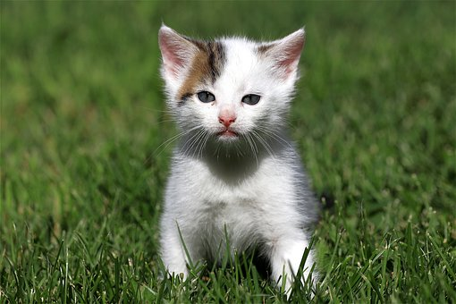

# JPG Injector

### Inject any kind of data into a JPG image without affecting it.

#### **Commands:**

```
inject [input.jpg] [payload.*] [output.jpg]
```

Injects the specified payload into the specified JPG

****

```
extract [injected.jpg] [extracted_payload.*]
```

Extracts injected payload from the specified JPG into a separate file

### **Example**

We have a JPG image

###### _cat.jpg_


and some kind of data (can be a file of any type)

###### _supersecret_

```
my credit card number
6969696969696969696969
```

Using the `inject` command, you can inject the `cat.jpg` image 
with the contents of `supersecret` without affecting
the `cat.jpg` image at all.

```
jj inject cat.jpg supersecret cat_injected_with_supersecret.jpg
```

Output:

###### _cat_injected_with_supersecret.jpg_


As you can see, it has not changed a bit.

Now, you can extract what you just injected using the `extract` command.

```
jj extract cat_injected_with_supersecret.jpg payload.txt
```

Output:

###### _payload_
```
my credit card number
6969696969696969696969
```
